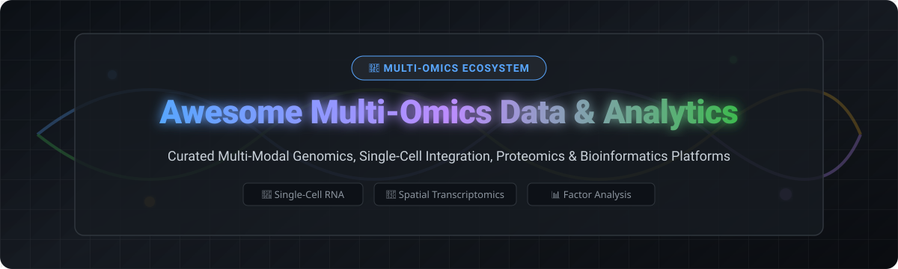

# Awesome Multi-Omics Data & Analytics 🧬

  

  
  
  
  
  

---

## 🌟 Overview & Market Ecosystem

Welcome to the ultimate curated list of **Multi-Omics Data Analysis**, **Single-Cell Multimodal Integration**, **Genomics Bioinformatics Pipelines**, and **Computational Biology Platforms**.

This repository tracks notable **commercial multi-omics platforms (SaaS)** and **top open-source GitHub projects** that integrate and analyze biological data across multiple omics layers — including **genomics, transcriptomics, epigenomics, proteomics, metabolomics, and spatial transcriptomics** — to accelerate biomedical research, biomarker discovery, and drug development.

---

## 📑 Table of Contents

- [☁️ SaaS / Hosted Platforms](#-saas--hosted-platforms)
- [🔓 Open-Source GitHub Projects](#-open-source-github-projects)
- [🤝 How to Contribute](#-how-to-contribute)
- [⚠️ Disclaimer](#%EF%B8%8F-disclaimer)
- [💖 Support & Sponsorship](#-support--sponsorship)
- [⭐ Star History](#-star-history)

---

## ☁️ SaaS / Hosted Platforms

The global multi-omics software and data integration market is estimated at **$2.8 billion to $5.7 billion** (projected to reach over **$33 billion by 2033**). The sector is **highly fragmented**, characterized by specialized niche tools and cloud platforms coexisting alongside hardware/sequencer ecosystems, rather than a single "winner-take-all" dominant player.

| Platform / Product | Description & Best Use | Estimated Company Size (Market Cap / Valuation / Revenue) | Starting Tier Pricing | Free Tier / Free Trial Limits |
| :--- | :--- | :--- | :--- | :--- |
| **[AWS HealthOmics](https://aws.amazon.com/healthomics/)** | **AWS's managed multi-omics service** — store, query, and analyze genomic and multi-omics data at scale. **Best for AWS-native bioinformatics workloads.** | **$1.85T Market Cap / $123B+ AWS Annual Revenue** (Amazon) | $0.0006/GB-hr run storage; compute from ~$0.06/hr (`omics.m.xlarge`) | AWS Free Tier: 275 `omics.m.xlarge` instance hours, 49k GB-hrs run storage, 1.5k GB-months active storage + $200 initial AWS credits |
| **[Illumina Connected Analytics](https://www.illumina.com/)** | **Illumina's cloud platform** — genomic data management, analysis, and collaboration. **Best for Illumina sequencing workflows.** | **$41.2B Market Cap / $4.3B Revenue** (Illumina) | $1 per Illumina BioInsight Credit (BIC); storage from 22.5 BIC/TB/month | 30-day free trial with 100 BioInsight Credits (BIC) and 1 TB cloud storage |
| **[BaseSpace](https://www.illumina.com/)** | **Illumina's cloud platform** — sequencing data analysis and storage. **Best for Illumina users.** | **$41.2B Market Cap / $4.3B Revenue** (Illumina) | $1 per Illumina BioInsight Credit (BIC); pay-as-you-go compute & storage | 30-day free trial with 100 BioInsight Credits (BIC) and 1 TB storage |
| **[Terra](https://terra.bio/)** | **Broad Institute's cloud platform** — collaborative biomedical data analysis with WDL and notebooks. **Best for research collaboration.** | **~$600M Annual Institutional Budget** (Broad Institute of MIT and Harvard) | Platform is free; Google Cloud infrastructure usage from ~$0.04/hr compute & $0.02/GB/month | $300 free Google Cloud credits upon new Google Cloud billing account setup |
| **[DNAnexus](https://www.dnanexus.com/)** | **Biomedical data platform** — multi-omics data management and analysis with compliance. **Best for enterprise genomics.** | **~$600M Valuation** ($473M total funding raised) | Custom enterprise tier from ~$20,000/year base platform licensing + compute consumption | 14-day evaluation trial environment upon sales inquiry approval; free access tiers for UK Biobank RAP approved researchers |
| **[Velsera](https://www.velsera.com/)** | **Precision medicine platform** — multi-omics data integration and analysis. **Best for clinical genomics.** | **~$350M–$500M Est. Valuation** (Formed via merger of Seven Bridges & PierianDx) | Enterprise custom licensing starting from ~$15,000/year platform subscription | 14-day evaluation environment available upon request for enterprise biopharma & clinical trials |
| **[Seven Bridges](https://www.sevenbridges.com/)** | **Biomedical data analysis platform** — multi-omics workflows and collaboration. **Best for large-scale genomics research.** | **~$300M Est. Valuation** (Acquired & merged into Velsera by Summa Equity) | Enterprise custom licensing from ~$15,000/year platform subscription + cloud compute | 14-day platform demo evaluation environment available upon direct sales request |
| **[BC Platforms](https://www.bcplatforms.com/)** | **Genomic data management** — multi-omics integration for research and clinical use. **Best for clinical research.** | **~$150M Est. Valuation** ($55.4M funding raised) | Enterprise licensing starting from ~$10,000/year or custom AWS Marketplace private offer | 30-day sandbox pilot environment provided upon clinical enterprise request |
| **[LatchBio](https://latch.bio/)** | **Serverless bioinformatics workflows** — Python SDK for building and deploying pipelines. **Best for developer-friendly bioinformatics.** | **~$100M Est. Valuation** ($33M funding raised) | $1 per Latch Credit; pay-as-you-go workflow compute from $0.05/hr | 7-day enterprise pilot trial; free unlimited platform access tier for academic research users |
| **[Form Bio](https://www.formbio.com/)** | **Computational biology platform** — multi-omics analysis with AI. **Best for drug discovery.** | **~$80M Est. Valuation** ($30.5M funding raised) | Custom enterprise subscription starting from ~$12,000/year for biopharma suites | 14-day guided sandbox demo trial for verified biotech & pharma teams |

---

## 🔓 Open-Source GitHub Projects

Multi-omics data integration relies heavily on robust open-source statistical frameworks, high-dimensional container specifications, and scalable workflow execution engines.

Projects are ranked below by **GitHub Star Count (descending)**:

1. 🌌 **[Galaxy](https://github.com/galaxyproject/galaxy)**   
   **Open-source web-based platform for reproducible bioinformatics and multi-omics analysis.** Provides thousands of computational tools across single-cell, spatial transcriptomics, and multi-modal workflows with 250GB free compute storage for researchers.

2. 🧬 **[Scanpy](https://github.com/scverse/scanpy)**   
   **The scverse standard Python toolkit for single-cell gene expression and multimodal omics analysis.** Built on `AnnData`, Scanpy provides scalable preprocessing, visualization, clustering, trajectory inference, and multi-modal integration.

3. 🔬 **[Seurat](https://github.com/satijalab/seurat)**   
   **Leading R toolkit for single-cell genomics and multimodal omics integration.** Features Weighted Nearest Neighbor (WNN) analysis to join CITE-seq, scATAC-seq, and RNA-seq modalities seamlessly.

4. 🤖 **[scvi-tools](https://github.com/scverse/scvi-tools)**   
   **Deep probabilistic modeling framework for single-cell and spatial omics.** Uses PyTorch to power deep generative integration models including totalVI, MultiVI, and scVI.

5. 🛠️ **[scikit-bio](https://github.com/scikit-bio/scikit-bio)**   
   **Community-driven Python data structures, algorithms, and educational resources for bioinformatics.** Widely used across multi-omics, microbiome, and sequence alignment pipelines.

6. ⚡ **[nf-core / tools](https://github.com/nf-core/tools)**   
   **Curated suite of Nextflow pipelines and helper tooling.** Powers reproducible processing of bulk and single-cell RNA-seq, ATAC-seq, proteomics, and multi-omics datasets.

7. 📊 **[MOFA2 (Multi-Omics Factor Analysis)](https://github.com/bioFAM/MOFA2)**   
   **Unsupervised factor analysis framework for multi-omics integration.** Decomposes biological matrices into interpretable latent factors capturing shared vs. view-specific biological signals across genomics, transcriptomics, and metabolomics.

8. 🧪 **[mixOmics](https://github.com/mixomicsteam/mixomics)**   
   **Multivariate R package for multi-omics feature selection and integration.** Implements DIABLO for supervised integration and sPLS for sparse partial least squares across heterogeneous biological layers.

9. 🐭 **[muon](https://github.com/scverse/muon)**   
   **Python framework for multimodal single-cell data analysis.** Uses the `MuData` container format to coordinate multimodal objects, Leiden/Louvain multiplex clustering, and GPU-accelerated operations.

10. 📦 **[MultiAssayExperiment](https://github.com/waldronlab/MultiAssayExperiment)**   
    **Bioconductor standard data structure for coordinating multi-omics experiments.** Standardizes metadata (`colData`), experimental assays (`ExperimentList`), and sample mappings across clinical and cancer datasets.

11. 🔗 **[SNFtool (Similarity Network Fusion)](https://cran.r-universe.dev/SNFtool)**   
    **Patient stratification framework through multi-omics network fusion.** Fuses distinct omics similarity networks into a unified patient network for spectral clustering and subtype discovery.

---

## 🤝 How to Contribute

Contributions are warmly welcomed! Help us keep this multi-omics analytics ecosystem comprehensive and up to date.

1. 🍴 **Fork** this repository.
2. 📝 **Add/Edit** entries in `README.md` following the table / list format.
3. 🔗 **Provide Factual Details**: Include product name, official link, star badge, and clear description.
4. 🚀 **Submit a Pull Request** with a brief summary of additions.

For list guidelines, see [Awesome-Awesome-Awesome](https://github.com/ishandutta2007/Awesome-Awesome-Awesome).

---

## ⚠️ Disclaimer

- This is a **community-curated index** for informational and educational purposes.
- Multi-omics datasets frequently contain sensitive patient genomic information. Ensure proper HIPAA, GDPR, and security controls before deploying self-hosted stacks.
- **Statistical Compatibility**: Match the analytical method to your hypothesis — MOFA2 for unsupervised factor discovery, mixOmics for supervised biomarker selection, SNF for patient subtyping, and scVI/Seurat/muon for single-cell multimodal integration.

---

## 💖 Support & Sponsorship

If you find this multi-omics analytics compilation helpful for your research, clinical projects, or development, please consider showing your support:

- ⭐ **Star this repository** to help others discover it!
- 🔀 **Fork & Share** with fellow bioinformaticians and computational biologists.
- ☕ **Buy Me a Coffee / Sponsor**: Support ongoing maintenance via [GitHub Sponsors](https://github.com/sponsors/ishandutta2007).

---

## ⭐ Star History

---

  <b>Made for bioinformaticians, computational biologists, and life science data leaders worldwide.</b>

